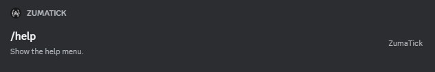
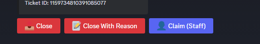
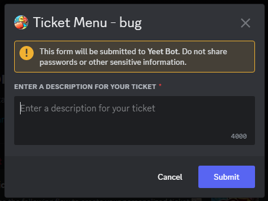
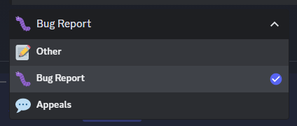

# Kormmand
A simple `command`, `button`, `select menu` and `modal` manager for [Kord](https://github.com/kordlib/kord), a Kotlin Discord 
API 
wrapper.
    


**Planned features:**
- [x] Slash command manager
- [X] Button manager
- [X] Select menu manager
- [X] Modal manager
- [ ] Automatic help menu

## Made with love by [@azuyamat](https://azuyamat.com)


# Table of Contents
- [Installation](#installation)
- [Usage](#usage)
- [Contributing](#contributing)

## Installation
Kormmand is available on [Jitpack](https://jitpack.io). Here is how to add it to your project.

> Note: Replace `Tag` with the latest version of Kormmand.

<details>
  <summary>Maven</summary>

#### Repository 
```xml
<repository>
    <id>jitpack.io</id>
    <url>https://jitpack.io</url>
</repository>
```

#### Dependency
```xml
<dependency>
    <groupId>com.github.Azuyamat</groupId>
    <artifactId>Kormmand</artifactId>
    <version>Tag</version>
</dependency>
```
</details>

<details>
  <summary>Gradle</summary>

#### Repository
```groovy
repositories {
    mavenCentral()
    maven { url 'https://jitpack.io' }
}
```

#### Dependency
```groovy
dependencies {
        implementation 'com.github.Azuyamat:Kormmand:Tag'
}
```
</details>

<details>
  <summary>Kotlin Gradle</summary>

#### Repository
```groovy
repositories {
    mavenCentral()
    maven("https://jitpack.io")
}
```

#### Dependency
```groovy
dependencies {
    implementation("com.github.Azuyamat:Kormmand:Tag")
}
```
</details>

## Usage

<details>
  <summary>Commands</summary>



### Creating a command

To create a command, start by initializing a class that extends the `Command` interface.
```kotlin
class HelpCommand : Command {
    override val name: String = "help"
    override val description: String = "Show the help menu."

    override suspend fun execute(event: GuildChatInputCommandInteractionCreateEvent) {
        event.interaction.respondPublic {
            content = "This is a test" }
    }
}
```

### Registering command

For a command to function, it must be registered by the bot at runtime. To do this, you must create a `CommandManager` and register the command.

<details>
  <summary>Multiple command</summary>

#### Global commands
```kotlin
val commandManager = CommandManager()

commandManager.registerCommands(
    listOf(
        HelpCommand()
    )
)
```
#### Guild commands
```kotlin
val commandManager = CommandManager()

commandManager.registerCommands(
    listOf(
        HelpCommand()
    ), "GUILDID"
)
```
</details>

<details>
  <summary>Single command</summary>

#### Global command
```kotlin
import jdk.internal.joptsimple.HelpFormatter

val commandManager = CommandManager()

commandManager.registerCommand(HelpCommand())
```
#### Guild command
```kotlin
import jdk.internal.joptsimple.HelpFormatter

val commandManager = CommandManager()

commandManager.registerCommand(HelpCommand(), "GUILDID")
```
</details>

### Permission requirements

To add permission requirements to a command, you must add the `permission` property to the command.

```kotlin
class HelpCommand : Command {
    override val name: String = "help"
    override val description: String = "Show the help menu."
    override val permission: Permission
        get() = Permission.Administrator

    override suspend fun execute(event: GuildChatInputCommandInteractionCreateEvent) {
        event.interaction.respondPublic {
            content = "You are an admin!" }
    }
}
```

### Adding subcommands

To add subcommands to a command, you must add the `builder` property to the command.

```kotlin
class HelpCommand : Command {
    override val name: String = "help"
    override val description: String = "Show the help menu."
    override val builder: GlobalChatInputCreateBuilder.() -> Unit
        get() = {
            subCommand("info", "Get info about a user."){
                user("user", "The user to get info about.")
            }
        }

    override suspend fun execute(event: GuildChatInputCommandInteractionCreateEvent) {
        val interaction = event.interaction
        val c = interaction.command
        val subCommandName = when (c) {
            is RootCommand -> null
            is GroupCommand -> c.name
            is SubCommand -> c.name
        }

        if (subCommandName == "info") {
            interaction.respondPublic {
                content = "This is a test" 
            }
        }
    }
}
```

</details>

<details>
  <summary>Buttons</summary>



### Creating a button

To create a button, start by initializing a class that extends the `Button` interface.
```kotlin
class HelpButton : Button {
    override val id: String = "help"
    override val name: String = "help" // Not required for buttons
    override val description: String = "Show the help menu." // Not required for buttons

    override suspend fun execute(event: ButtonInteractionCreateEvent) {
        event.interaction.respondPublic {
            content = "This is a test" }
    }
}
```

### Registering a button

For a button to function, it must be registered by the bot at runtime. To do this, you must create a `ButtonManager` 
and register the button.

<details>
  <summary>Multiple buttons</summary>

```kotlin
val buttonManager = ButtonManager()

buttonManager.registerButtons(
    listOf(
        TicketButton()
    )
)
```
</details>

<details>
  <summary>Single button</summary>

```kotlin
val buttonManager = ButtonManager()

buttonManager.registerButton(TicketButton())
```
</details>

### Permission requirements

To add permission requirements to a button, you must add the `permission` property to the button.

```kotlin
class HelpButton : Button {
    override val name: String = "help" // Not required for buttons
    override val description: String = "Show the help menu." // Not required for buttons
    override val permission: Permission
        get() = Permission.Administrator

    override suspend fun execute(event: ButtonInteractionCreateEvent) {
        event.interaction.respondPublic {
            content = "You are an admin!" }
    }
}
```
</details>

<details>
  <summary>Modals</summary>



### Creating a modal

To create a modal, start by initializing a class that extends the `Modal` interface.
```kotlin
class HelpModal : Modal {
    override val id: String = "modal"
    override val name: String = "modal" // Not required for modals
    override val description: String = "Show the help menu." // Not required for modals

    override suspend fun execute(event: ModalSubmitInteractionCreateEvent) {
        event.interaction.respondPublic {
            content = "This is a test" }
    }
}
```

### Registering a modal

For a modal to function, it must be registered by the bot at runtime. To do this, you must create a `ModalManager`
and register the modal.

<details>
  <summary>Multiple modals</summary>

```kotlin
val modalManager = ModalManager()

modalManager.registerModals(
    listOf(
        HelpModal()
    )
)
```
</details>

<details>
  <summary>Single modal</summary>

```kotlin
val modalManager = ModalManager()

modalManager.registerModal(HelpModal())
```
</details>

### Permission requirements

To add permission requirements to a command, you must add the `permission` property to the modal.

```kotlin
class HelpModal : Modal {
    override val name: String = "help" // Not required for modals
    override val description: String = "Show the help menu." // Not required for modals
    override val permission: Permission
        get() = Permission.Administrator

    override suspend fun execute(event: ModalSubmitInteractionCreateEvent) {
        event.interaction.respondPublic {
            content = "You are an admin!" }
    }
}
```
</details>

<details>
  <summary>Select Menus</summary>



### Creating a menu

To create a select menu, start by initializing a class that extends the `SelectMenu` interface.
```kotlin
class HelpMenu : SelectMenu {
    override val id: String = "jeff"
    override val name: String = "jeff" // Not required for select menus
    override val description: String = "Show the help menu." // Not required for select menus

    override suspend fun execute(event: SelectMenuInteractionCreateEvent) {
        event.interaction.respondPublic {
            content = "This is a test" }
    }
}
```

### Registering a menu

For a select menu to function, it must be registered by the bot at runtime. To do this, you must create a 
`SelectMenuManager`
and register the select menu.

<details>
  <summary>Multiple select menus</summary>

```kotlin
val selectMenuManager = SelectMenuManager()

selectMenuManager.registerSelectMenus(
    listOf(
        HelpMenu()
    )
)
```
</details>

<details>
  <summary>Single modal</summary>

```kotlin
val selectMenuManager = SelectMenuManager()

selectMenuManager.registerSelectMenu(HelpMenu())
```
</details>

### Permission requirements

To add permission requirements to a command, you must add the `permission` property to the select menu.

```kotlin
class HelpMenu : SelectMenu {
    override val name: String = "help" // Not required for select menu
    override val description: String = "Show the help menu." // Not required for select menu
    override val permission: Permission
        get() = Permission.Administrator

    override suspend fun execute(event: SelectMenuInteractionCreateEvent) {
        event.interaction.respondPublic {
            content = "You are an admin!" }
    }
}
```
</details>

> *Note: Buttons, modals and select menus use the first part of the interaction id. This means you can split your 
> interaction id by `//` and use the first part as the id while having the rest as interaction parameters.*
> 
> Example:
> ```kotlin
> val task = interaction.modalId.split("//")[1]
> ```

## Contributing

Contributions are welcome! If you have any issues or feature requests, please open an issue or a pull request.

## License

This project is licensed under the MIT License - see the [LICENSE](LICENSE) file for details.